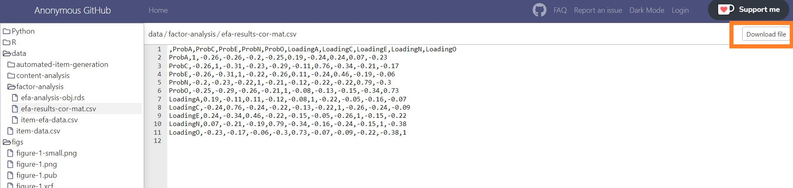

Getting Started
================

#### Disclaimer

To remain anonymous during the review process this Github repository has
masked identifying information. This restricts the functionality of the
repository as it *cannot* be cloned or downloaded as a `.zip` file.

Files can be downloaded individually using the `download file` button in
the top left corner.

## Scale Development Illustrations

Here is the list of tutorials described in our research:

| Task | Datasets Used | Colab Link
|---|:---:|:---:|
| [**Creating Fixed Sentence Embeddings**](https://anonymous.4open.science/r/transforming-personality-scales/vignettes/create-fixed-sentence-embeddings.md) | `item-data.csv` |
| [**Text Classification with Fixed Embeddings**](https://anonymous.4open.science/r/transforming-personality-scales/vignettes/classification-with-fixed-embeddings.md) | -`aggregate-word-embedding-data.csv` -`sentence-SBERT-embedding-data.csv` -`sentence-USE-embedding-data.csv` | 
| [**Fine-Tuning Transformers for Text Classification**](https://anonymous.4open.science/r/transforming-personality-scales/vignettes/fine_tuning_transformers_for_classification.md) | -`train-data.csv` -`test-data.csv`  |
| [**Few Shot Learning with Transformers**](https://anonymous.4open.science/r/transforming-personality-scales/vignettes/few-shot-learning-with-transformers.md) | -`train-data.csv` -`test-data.csv`  |

- Most example use `Python` though some `R` utilities are provided.
- Data can be found in the `data/` folder of this repository.
- We recommend using the **Colab notebooks** (in the tables above) to progress through the examples more easily.

## Downloading Code and Data

### Manual Download

A `.zip` file of the repository can be by accessing the repository’s
Github page then clicking the `clone` followed by `download zip`

### Using Command-Line

Files will be published on `Github` as a public repository. Those
wishing to download the files used in this research can do so in
command-line using the following commands:

#### PC

1.  PC Users should first download [Git
    Bash](https://gitforwindows.org/)
2.  Open **Git Bash**
3.  Change your directory to the location you would like to store the
    repository

<!-- -->

    $ cd ~/Documents/

4.  Use `git clone` to create a copy of the entire repository into the
    current directory

<!-- -->

    $ git clone https://github.com/REDACTED-FOR-REVIEW.git

#### Mac

1.  Mac Users should first download [Git](git-scm.com/downloads)
2.  Open the macOS **Terminal** App
3.  Change your directory to the location you would like to store the
    repository

<!-- -->

     cd ~/

4.  Use `git clone` to create a copy of the entire repository into the
    current directory

<!-- -->

    git clone https://github.com/REDACTED-FOR-REVIEW.git

## Google Colab

For an overview of Google Colab please see the following notebook

